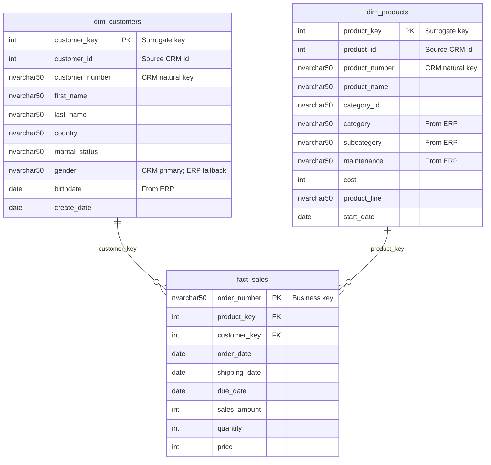

# SQL Data Warehouse Project

## 🚀 Project Overview

This project implements a **SQL Server Data Warehouse** following the **Medallion Architecture** (Bronze → Silver → Gold layers). It demonstrates real-world ETL patterns including data extraction from multiple source systems, cleansing, transformation, and modelling into a star schema ready for analytics and reporting.

### Architecture

The following diagram illustrates the **Medallion Architecture** data pipeline — from raw source files through to analytics-ready views.

```mermaid
flowchart LR
    subgraph SRC["📦 Source Systems"]
        direction TB
        CRM[("🗄️ CRM System\ncust_info.csv\nprd_info.csv\nsales_details.csv")]
        ERP[("🗄️ ERP System\nCUST_AZ12.csv\nLOC_A101.csv\nPX_CAT_G1V2.csv")]
    end

    subgraph BRZ["🥉 Bronze Layer — Raw Staging"]
        direction TB
        B1[bronze.crm_cust_info]
        B2[bronze.crm_prd_info]
        B3[bronze.crm_sales_details]
        B4[bronze.erp_cust_az12]
        B5[bronze.erp_loc_a101]
        B6[bronze.erp_px_cat_g1v2]
    end

    subgraph SLV["🥈 Silver Layer — Cleansed & Transformed"]
        direction TB
        S1[silver.crm_cust_info]
        S2[silver.crm_prd_info]
        S3[silver.crm_sales_details]
        S4[silver.erp_cust_az12]
        S5[silver.erp_loc_a101]
        S6[silver.erp_px_cat_g1v2]
    end

    subgraph GLD["🥇 Gold Layer — Star Schema / Analytics"]
        direction TB
        DC["📋 gold.dim_customers"]
        DP["📋 gold.dim_products"]
        FS["📊 gold.fact_sales"]
    end

    CRM -->|"BULK INSERT\n(proc_load_bronze)"| B1 & B2 & B3
    ERP -->|"BULK INSERT\n(proc_load_bronze)"| B4 & B5 & B6

    B1 -->|"Cleanse\n(proc_load_silver)"| S1
    B2 -->|"Cleanse\n(proc_load_silver)"| S2
    B3 -->|"Cleanse\n(proc_load_silver)"| S3
    B4 -->|"Cleanse\n(proc_load_silver)"| S4
    B5 -->|"Cleanse\n(proc_load_silver)"| S5
    B6 -->|"Cleanse\n(proc_load_silver)"| S6

    S1 & S4 & S5 -->|"Join & Enrich\n(ddl_gold)"| DC
    S2 & S6      -->|"Join & Enrich\n(ddl_gold)"| DP
    S3           -->|"Lookup Keys\n(ddl_gold)"| FS

    DC -->|customer_key| FS
    DP -->|product_key|  FS
```

---

## 🗂️ Data Model

The **Gold layer** exposes a classic **Star Schema** optimised for analytical queries. Surrogate keys are generated with `ROW_NUMBER()` so downstream BI tools have stable integer keys.



---

## 📊 Features

- ✅ **Medallion Architecture** – Bronze, Silver, and Gold schema separation
- ✅ **Star Schema** – Fact and dimension views optimised for analytics
- ✅ **ETL Stored Procedures** – Reusable, parameterless procedures with timing metrics
- ✅ **Data Cleansing** – Normalisation, deduplication, and null handling in the Silver layer
- ✅ **Data Quality Tests** – Validation scripts for Silver and Gold layers

---

## 🔧 Technologies Used

- **Microsoft SQL Server** (2016 or later recommended)
- T-SQL stored procedures, views, and `BULK INSERT`

---

## 📂 Repository Structure

```
sql-data-warehouse-project/
├── datasets/
│   ├── source_crm/          # CRM source CSV files
│   │   ├── cust_info.csv
│   │   ├── prd_info.csv
│   │   └── sales_details.csv
│   └── source_erp/          # ERP source CSV files
│       ├── CUST_AZ12.csv
│       ├── LOC_A101.csv
│       └── PX_CAT_G1V2.csv
├── scripts/
│   ├── init_database.sql    # Creates the DataWarehouse database and schemas
│   ├── bronze/
│   │   ├── ddl_bronze.sql         # Creates raw staging tables
│   │   └── proc_load_bronze.sql   # Loads CSVs into Bronze via BULK INSERT
│   ├── silver/
│   │   ├── ddl_silver.sql         # Creates cleansed tables
│   │   └── proc_load_silver.sql   # Transforms Bronze → Silver
│   └── gold/
│       └── ddl_gold.sql           # Creates analytics views (star schema)
└── tests/
    ├── quality_checks_silver.sql  # Data quality validation for Silver layer
    └── quality_checks_gold.sql    # Data quality validation for Gold layer
```

---

## 📈 How to Use

### Prerequisites

- SQL Server 2016+ with a login that has `BULK INSERT` and `CREATE DATABASE` permissions.
- The repository cloned to a local Windows machine (BULK INSERT requires local file access by the SQL Server service account).

### Step 1 – Update File Paths

Open `scripts/bronze/proc_load_bronze.sql` and replace the hardcoded `FROM '...'` paths in each `BULK INSERT` statement with the absolute path to the `datasets/` folder on your machine, for example:

```sql
FROM  '<your-local-path>/sql-data-warehouse-project/datasets/source_crm/cust_info.csv'
```

### Step 2 – Execute Scripts in Order

Run the following scripts sequentially in SQL Server Management Studio (SSMS) or Azure Data Studio:

| # | Script | Purpose |
|---|--------|---------|
| 1 | `scripts/init_database.sql` | Creates the `DataWarehouse` database and the `bronze`, `silver`, `gold` schemas |
| 2 | `scripts/bronze/ddl_bronze.sql` | Creates raw staging tables in the `bronze` schema |
| 3 | `scripts/bronze/proc_load_bronze.sql` | Creates the `bronze.load_bronze` stored procedure |
| 4 | `scripts/silver/ddl_silver.sql` | Creates cleansed tables in the `silver` schema |
| 5 | `scripts/silver/proc_load_silver.sql` | Creates the `silver.load_silver` stored procedure |
| 6 | `scripts/gold/ddl_gold.sql` | Creates the Gold-layer dimension and fact views |

### Step 3 – Load Data

```sql
USE DataWarehouse;

-- Load raw data from CSV files into the Bronze layer
EXEC bronze.load_bronze;

-- Cleanse and transform Bronze data into the Silver layer
EXEC silver.load_silver;

-- Gold layer views are query-ready immediately after step 6
```

### Step 4 – Run Quality Checks (Optional)

```sql
-- Validate Silver layer transformations
-- Open and execute: tests/quality_checks_silver.sql

-- Validate Gold layer model integrity
-- Open and execute: tests/quality_checks_gold.sql
```

### Step 5 – Query the Gold Layer

```sql
-- Dimension tables
SELECT * FROM gold.dim_customers;
SELECT * FROM gold.dim_products;

-- Fact table joined with dimensions
SELECT
    c.first_name,
    c.last_name,
    p.product_name,
    f.order_date,
    f.sales_amount
FROM gold.fact_sales f
JOIN gold.dim_customers c ON f.customer_key = c.customer_key
JOIN gold.dim_products  p ON f.product_key  = p.product_key;
```

---

## 📂 Data Sources

Sample datasets simulate a retail sales environment and are included in the `datasets/` directory.

| File | Source | Rows | Description |
|------|--------|------|-------------|
| `cust_info.csv` | CRM | 18,494 | Customer master (name, gender, marital status) |
| `prd_info.csv` | CRM | 398 | Product master (key, name, cost, line, dates) |
| `sales_details.csv` | CRM | 60,399 | Sales transactions (order, product, customer, amounts) |
| `CUST_AZ12.csv` | ERP | 18,484 | Customer attributes (birthdate, gender) |
| `LOC_A101.csv` | ERP | 18,485 | Customer location/country mapping |
| `PX_CAT_G1V2.csv` | ERP | 37 | Product categories and subcategories |

---

## 👤 Author

**Dinesh Sai Palli**  
GitHub – https://github.com/Dinnu005  
LinkedIn – https://www.linkedin.com/in/dinesh-sai-825a992a5/

---

## 📝 License

This project is licensed under the MIT License – see the [LICENSE](LICENSE) file for details.

---

## 💡 Future Work

- Add indexes on dimension/fact tables for query performance
- Implement incremental loading (replace full truncate/reload)
- Integrate BI tools (Power BI / Tableau) for dashboards
- Add an ETL audit/logging table for run history
- Automate pipeline execution with SQL Server Agent or Apache Airflow

---

Thank you for checking out this project! If you have any questions or suggestions, feel free to open an issue or contact me.
